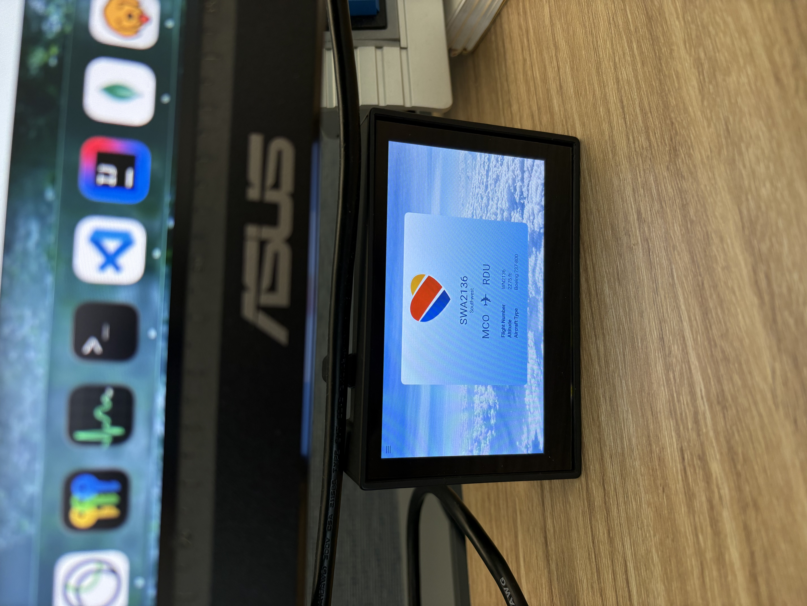

# PlaneApp

An Angular and Electron desktop app for displaying information about aircraft flying overhead. Designed to run on a dedicated desktop display unit, built using a Raspberry Pi 4 connected to an LCD screen. See `TODO.md` for roadmap of updates.



## Prerequisites

Before running the app, you will need API credentials from three sources. For info on how each of these are used within the app, see Sources section below.

1. OpenSky Network (https://opensky-network.org) --> Create an account and save your client ID and client secret.

2. AeroAPI (https://www.flightaware.com/commercial/aeroapi/) --> Create an account and sign up for the Personal tier. You will need to enter billing info, but this project does not make enough calls to exceed the monthly free $5 they provide unless you leave it running for extended periods of time (see notes on scheduling and pricing below). Save your API key.

3. Mapbox (https://www.mapbox.com) --> This is used for setting your location and getting longitude/latitude coordinates to call OpenSky Network. Save your token.

## Setup

1. Create a copy of `.env.example`. Name it `.env` and add your the credentials from the above sources.

2. Run `npm install` in the root directory

3. Install Angular packages:

   ```
   cd ui
   npm install
   ```

4. Change back to the root directory and start app with `npm run start`

## Notes

### Sources

This app uses 3 sources to get data. Below is a summary of each and how it is used in the app.

#### Mapbox

Gets longitude/latitude coordinates from an entered address. These coordinates are then used to call OpenSky to determine what location boundary to check for aircraft.

#### OpenSky Network

Finds aircraft within a longitude/latitude boundary.

#### AeroAPI from FlightAware

Takes the callsign of an overhead aircraft from OpenSky and returns more detailed info, such as the origin/destination airports, the type of aircraft, and the flight number. Only 1000 requests can be made to this API per month before it starts to incur costs, so this API is only called for airlines that are registered in the app. This helps cut down on requests since AeroAPI usually doesn't usually have much info on private/military aircraft anyway.

### Scheduling

The app is scheduled to stop searching for nearby aircraft at 10pm daily. This time can be adjusted in the app settings. This helps avoid excess API calls overnight when there are fewer aircraft overhead and when the device will not be in use.

### Pricing

AeroAPI is somewhat limiting with 1000 free calls per month. To avoid risking charges, don't leave the app running when it is not actively in use. The free tier limits of other APIs are high enough that there is no chance of exceeding them and incurring costs.

More info can be found in the documentation for each API.

- OpenSky REST API --> https://openskynetwork.github.io/opensky-api/rest.html
- FlightAware AeroAPI --> https://www.flightaware.com/aeroapi/portal/
- MapBox API --> https://docs.mapbox.com/api/search/geocoding/
